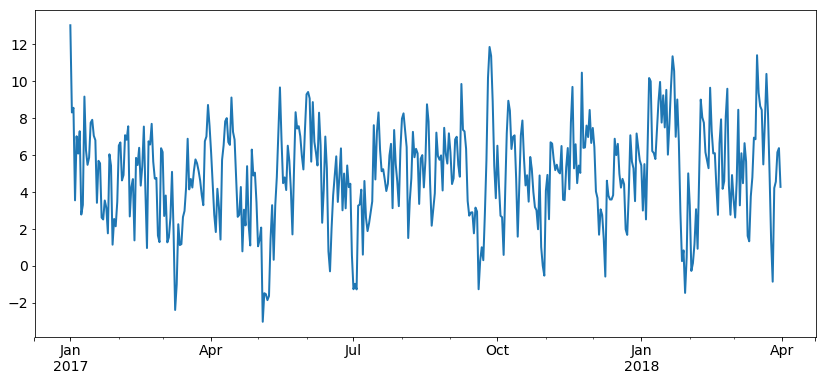
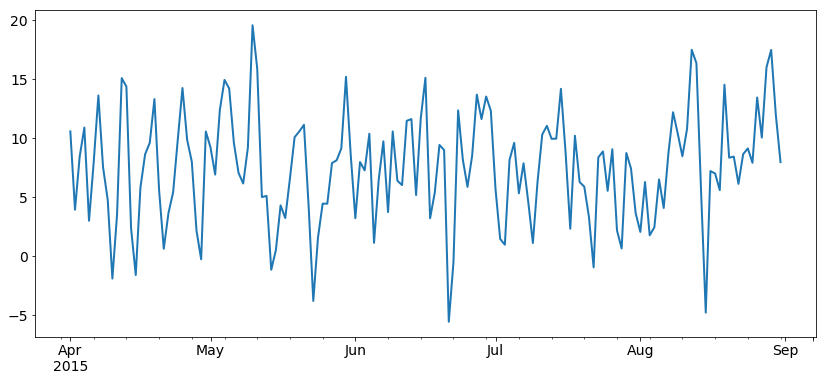
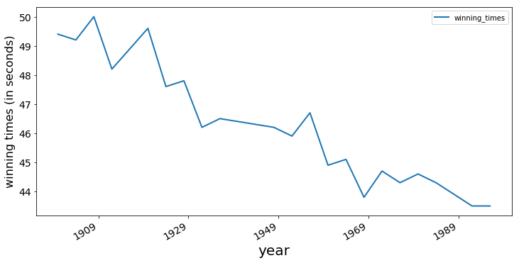
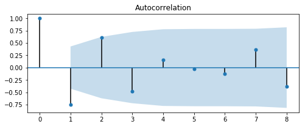
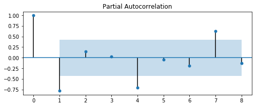

# ARMA Models - Lab

## Introduction

In this lab, you'll practice your knowledge the Autoregressive (AR), the Moving Average (MA) model, and the combined ARMA model.

## Objectives

You will be able to:
- Understand and explain what a Autoregressive model is
- Understand and explain what a Moving Average model is
- Understand and apply the mathematical formulations for Autoregressive and Moving Average models
- Understand how AR and MA can be combined in ARMA models

## Generate an AR model of the first order with $\phi = 0.7$


```python
#import the necessary libraries
```


```python
# __SOLUTION__ 
import pandas as pd
import matplotlib.pyplot as plt
import numpy as np
```

Recall that the AR model has the following formula:

$$Y_t = \mu + \phi * Y_{t-1}+\epsilon_t$$

This means that:

$$Y_1 = \mu + \phi * Y_{0}+\epsilon_1$$
$$Y_2 = \mu + \phi * (\text{mean-centered version of } Y_1) +\epsilon_2$$

and so on. 

Assume a mean-zero white noise with a standard deviation of 2. Make sure you have a daily datetime index ranging from January 2017 until the end of March 2018. Assume that $\mu=5$ and $Y_0= 8$.


```python
# keep the random seed
np.random.seed(11225)

# create a series with the specified dates

```


```python
# __SOLUTION__ 
# keep the random seed
np.random.seed(11225)

# create a series with the specified dates
dates = pd.date_range('2017-01-01', '2018-03-31')
len(dates)
```


    455


```python
# store the parameters

```


```python
# __SOLUTION__ 
error = np.random.normal(0,2,len(dates))
Y_0 = 8
mu = 5
phi = 0.7
```


```python
# generate the time series according to the formula

```


```python
# __SOLUTION__ 
TS = [None] * len(dates)
y = Y_0
for i, row in enumerate(dates):
    TS[i] = mu + y * phi + error[i]
    y = TS[i] - mu
```

Plot the time series and verify what you see


```python
# plot here
```


```python
# __SOLUTION__ 
series =  pd.Series(TS, index=dates)

series.plot(figsize=(14,6), linewidth=2, fontsize=14);
```





## Look at the ACF and PACF of your model and write down your conclusions

We recommend to use `plot_acf` in statsmodels instead of the pandas ACF variant.


```python
from statsmodels.graphics.tsaplots import plot_pacf
from statsmodels.graphics.tsaplots import plot_acf

```


```python
# __SOLUTION__ 
from statsmodels.graphics.tsaplots import plot_pacf
from statsmodels.graphics.tsaplots import plot_acf

fig, ax = plt.subplots(figsize=(16,3))
plot_acf(series,ax=ax, lags=40);

fig, ax = plt.subplots(figsize=(16,3))
plot_pacf(series,ax=ax, lags=40);
```


## Check your model with ARMA in statsmodels

Statsmodels also has a tool that fits ARMA models on time series. The only thing you have to do is provide the number of orders for AR vs MA. Have a look at the code below, and the output of the code. Make sure that the output for the $\phi$ parameter and $\mu$ is as you'd expect!


```python
# assuming your time series are stored in an object "series"
# Import the ARMA module from statsmodels
from statsmodels.tsa.arima_model import ARMA
import statsmodels.api as sm

# Fit an MA(1) model to the first simulated data
mod_arma = ARMA(series, order=(1,0))
res_arma = mod_arma.fit()

# Print out summary information on the fit
print(res_arma.summary())

# Print out the estimate for the constant and for theta
print(res_arma.params)
```


```python
# __SOLUTION__ 
# assuming your time series are stored in an object "series"
# Import the ARMA module from statsmodels
from statsmodels.tsa.arima_model import ARMA
import statsmodels.api as sm

# Fit an AR(1) model to the first simulated data
mod_arma = ARMA(series, order=(1,0))
res_arma = mod_arma.fit()

# Print out summary information on the fit
print(res_arma.summary())

# Print out the estimate for the constant and for theta
print(res_arma.params)
```

                                  ARMA Model Results                              
    ==============================================================================
    Dep. Variable:                      y   No. Observations:                  455
    Model:                     ARMA(1, 0)   Log Likelihood                -968.698
    Method:                       css-mle   S.D. of innovations              2.033
    Date:                Sun, 02 Dec 2018   AIC                           1943.395
    Time:                        22:42:32   BIC                           1955.756
    Sample:                    01-01-2017   HQIC                          1948.265
                             - 03-31-2018                                         
    ==============================================================================
                     coef    std err          z      P>|z|      [0.025      0.975]
    ------------------------------------------------------------------------------
    const          4.9664      0.269     18.444      0.000       4.439       5.494
    ar.L1.y        0.6474      0.036     17.880      0.000       0.576       0.718
                                        Roots                                    
    =============================================================================
                      Real          Imaginary           Modulus         Frequency
    -----------------------------------------------------------------------------
    AR.1            1.5446           +0.0000j            1.5446            0.0000
    -----------------------------------------------------------------------------
    const      4.966376
    ar.L1.y    0.647429
    dtype: float64


## Generate an MA model of the first order with $\theta = 0.9$

Recall that the MA model has the following formula:

$$Y_t = \mu +\epsilon_t + \theta * \epsilon_{t-1}$$

This means that:

$$Y_1 = \mu + \epsilon_1+  \theta * \epsilon_{0}$$
$$Y_2 = \mu + \epsilon_2+  \theta * \epsilon_{1}$$

and so on. 

Assume a mean-zero white noise with a standard deviation of 4. Make sure you have a daily datetime index is ranging from April 2015 until the end of August 2015. Assume that $\mu=7$.


```python
# keep the random seed
np.random.seed(1234)

# create a series with the specified dates


# store the parameters


#generate the time series

```


```python
# __SOLUTION__ 
# keep the random seed
np.random.seed(1234)

# create a series with the specified dates
dates = pd.date_range('2015-04-01', '2015-08-31')
len(dates)

error = np.random.normal(0,4,len(dates))
mu = 7
theta = 0.9

TS = [None] * len(dates)
error_prev = error[0]
for i, row in enumerate(dates):
    TS[i] = mu + theta * error_prev +error[i]
    error_prev = error[i]
```


```python
# Plot the time series
```


```python
# __SOLUTION__ 
series =  pd.Series(TS, index=dates)

series.plot(figsize=(14,6), linewidth=2, fontsize=14);
```





## Look at the ACF and PACF of your model and write down your conclusions


```python
# plots here
```


```python
# __SOLUTION__ 
from statsmodels.graphics.tsaplots import plot_pacf
from statsmodels.graphics.tsaplots import plot_acf

fig, ax = plt.subplots(figsize=(16,3))
plot_acf(series,ax=ax, lags=40);

fig, ax = plt.subplots(figsize=(16,3))
plot_pacf(series,ax=ax, lags=40);
```


## Check your model with ARMA in statsmodels

Repeat what you did for your AR model but now for your MA model to verify the parameters are estimated correctly.


```python
# Fit an AR(1) model to the first simulated data


# Print out summary information on the fit

```


```python
# __SOLUTION__ 
# assuming your time series are stored in an object "series"
# Import the ARMA module from statsmodels
from statsmodels.tsa.arima_model import ARMA
import statsmodels.api as sm

# Fit an MA(1) model to the first simulated data
mod_arma = ARMA(series, order=(0,1))
res_arma = mod_arma.fit()

# Print out summary information on the fit
print(res_arma.summary())
```

                                  ARMA Model Results                              
    ==============================================================================
    Dep. Variable:                      y   No. Observations:                  153
    Model:                     ARMA(0, 1)   Log Likelihood                -426.378
    Method:                       css-mle   S.D. of innovations              3.909
    Date:                Sun, 02 Dec 2018   AIC                            858.757
    Time:                        22:42:34   BIC                            867.848
    Sample:                    04-01-2015   HQIC                           862.450
                             - 08-31-2015                                         
    ==============================================================================
                     coef    std err          z      P>|z|      [0.025      0.975]
    ------------------------------------------------------------------------------
    const          7.5373      0.590     12.776      0.000       6.381       8.694
    ma.L1.y        0.8727      0.051     17.165      0.000       0.773       0.972
                                        Roots                                    
    =============================================================================
                      Real          Imaginary           Modulus         Frequency
    -----------------------------------------------------------------------------
    MA.1           -1.1459           +0.0000j            1.1459            0.5000
    -----------------------------------------------------------------------------


## Create a model for the 400m data set

Import the data set containing the historical running times for the men's 400m on the Olympic games.


```python
# the data is in "winning_400m.csv"
```


```python
# __SOLUTION__ 
data = pd.read_csv("winning_400m.csv")
data.year = data.year.astype(str)
data.year = pd.to_datetime(data.year.astype(str))

col_name= 'year'
data.set_index(col_name, inplace=True)
```

Plot the data


```python
# your code here
```


```python
# __SOLUTION__ 
data.plot(figsize=(12,6), linewidth=2, fontsize=14)
plt.xlabel(col_name, fontsize=20)
plt.ylabel("winning times (in seconds)", fontsize=16);
```





Difference the data to get a stationary time series. Make sure to remove the first NaN value.


```python
# your code here
```


```python
# __SOLUTION__ 
data_diff = data.diff().dropna()
data_diff
```


<div>
<style scoped>
    .dataframe tbody tr th:only-of-type {
        vertical-align: middle;
    }

    .dataframe tbody tr th {
        vertical-align: top;
    }

    .dataframe thead th {
        text-align: right;
    }
</style>
<table border="1" class="dataframe">
  <thead>
    <tr style="text-align: right;">
      <th></th>
      <th>winning_times</th>
    </tr>
    <tr>
      <th>year</th>
      <th></th>
    </tr>
  </thead>
  <tbody>
    <tr>
      <th>1904-01-01</th>
      <td>-0.2</td>
    </tr>
    <tr>
      <th>1908-01-01</th>
      <td>0.8</td>
    </tr>
    <tr>
      <th>1912-01-01</th>
      <td>-1.8</td>
    </tr>
    <tr>
      <th>1920-01-01</th>
      <td>1.4</td>
    </tr>
    <tr>
      <th>1924-01-01</th>
      <td>-2.0</td>
    </tr>
    <tr>
      <th>1928-01-01</th>
      <td>0.2</td>
    </tr>
    <tr>
      <th>1932-01-01</th>
      <td>-1.6</td>
    </tr>
    <tr>
      <th>1936-01-01</th>
      <td>0.3</td>
    </tr>
    <tr>
      <th>1948-01-01</th>
      <td>-0.3</td>
    </tr>
    <tr>
      <th>1952-01-01</th>
      <td>-0.3</td>
    </tr>
    <tr>
      <th>1956-01-01</th>
      <td>0.8</td>
    </tr>
    <tr>
      <th>1960-01-01</th>
      <td>-1.8</td>
    </tr>
    <tr>
      <th>1964-01-01</th>
      <td>0.2</td>
    </tr>
    <tr>
      <th>1968-01-01</th>
      <td>-1.3</td>
    </tr>
    <tr>
      <th>1972-01-01</th>
      <td>0.9</td>
    </tr>
    <tr>
      <th>1976-01-01</th>
      <td>-0.4</td>
    </tr>
    <tr>
      <th>1980-01-01</th>
      <td>0.3</td>
    </tr>
    <tr>
      <th>1984-01-01</th>
      <td>-0.3</td>
    </tr>
    <tr>
      <th>1988-01-01</th>
      <td>-0.4</td>
    </tr>
    <tr>
      <th>1992-01-01</th>
      <td>-0.4</td>
    </tr>
    <tr>
      <th>1996-01-01</th>
      <td>0.0</td>
    </tr>
  </tbody>
</table>
</div>


```python
# Look at ACF and PACF
```


```python
# __SOLUTION__ 
 from statsmodels.graphics.tsaplots import plot_acf
from statsmodels.graphics.tsaplots import plot_pacf

fig, ax = plt.subplots(figsize=(8,3))
plot_acf(data_diff,ax=ax, lags=8);

fig, ax = plt.subplots(figsize=(8,3))
plot_pacf(data_diff,ax=ax, lags=8);
```








Based on the ACF and PACF, fit an arma model with the right orders for AR and MA. Feel free to try different models and compare AIC and BIC values, as well as significance values for the parameter estimates.


```python
# your code here
```


```python
# __SOLUTION__ 
# Import the ARMA module from statsmodels
from statsmodels.tsa.arima_model import ARMA
import statsmodels.api as sm

# Fit an ARMA(2,1) model to the first simulated data
mod_arma = ARMA(data_diff, order=(2,1))
res_arma = mod_arma.fit()

# Print out summary information on the fit
print(res_arma.summary())

# Print out the estimate for the constant and for theta
print(res_arma.params)
```

                                  ARMA Model Results                              
    ==============================================================================
    Dep. Variable:          winning_times   No. Observations:                   21
    Model:                     ARMA(2, 1)   Log Likelihood                 -18.955
    Method:                       css-mle   S.D. of innovations              0.562
    Date:                Sun, 02 Dec 2018   AIC                             47.911
    Time:                        22:42:37   BIC                             53.133
    Sample:                             0   HQIC                            49.044
                                                                                  
    =======================================================================================
                              coef    std err          z      P>|z|      [0.025      0.975]
    ---------------------------------------------------------------------------------------
    const                  -0.2915      0.073     -4.018      0.001      -0.434      -0.149
    ar.L1.winning_times    -1.6827      0.119    -14.199      0.000      -1.915      -1.450
    ar.L2.winning_times    -0.7714      0.128     -6.022      0.000      -1.022      -0.520
    ma.L1.winning_times     0.9999      0.132      7.550      0.000       0.740       1.259
                                        Roots                                    
    =============================================================================
                      Real          Imaginary           Modulus         Frequency
    -----------------------------------------------------------------------------
    AR.1           -1.0907           -0.3268j            1.1386           -0.4537
    AR.2           -1.0907           +0.3268j            1.1386            0.4537
    MA.1           -1.0001           +0.0000j            1.0001            0.5000
    -----------------------------------------------------------------------------
    const                 -0.291549
    ar.L1.winning_times   -1.682687
    ar.L2.winning_times   -0.771400
    ma.L1.winning_times    0.999888
    dtype: float64


    /Users/lore.dirick/anaconda3/lib/python3.6/site-packages/statsmodels/tsa/base/tsa_model.py:225: ValueWarning: A date index has been provided, but it has no associated frequency information and so will be ignored when e.g. forecasting.
      ' ignored when e.g. forecasting.', ValueWarning)


```python
# Try another one
```


```python
# __SOLUTION__ 
# Import the ARMA module from statsmodels
from statsmodels.tsa.arima_model import ARMA
import statsmodels.api as sm

# Fit an ARMA(2,2) model to the first simulated data
mod_arma = ARMA(data_diff, order=(2,2))
res_arma = mod_arma.fit()

# Print out summary information on the fit
print(res_arma.summary())

# Print out the estimate for the constant and for theta
print(res_arma.params)
```

    /Users/lore.dirick/anaconda3/lib/python3.6/site-packages/statsmodels/tsa/base/tsa_model.py:225: ValueWarning: A date index has been provided, but it has no associated frequency information and so will be ignored when e.g. forecasting.
      ' ignored when e.g. forecasting.', ValueWarning)


                                  ARMA Model Results                              
    ==============================================================================
    Dep. Variable:          winning_times   No. Observations:                   21
    Model:                     ARMA(2, 2)   Log Likelihood                 -16.472
    Method:                       css-mle   S.D. of innovations              0.461
    Date:                Sun, 02 Dec 2018   AIC                             44.943
    Time:                        22:42:37   BIC                             51.210
    Sample:                             0   HQIC                            46.303
                                                                                  
    =======================================================================================
                              coef    std err          z      P>|z|      [0.025      0.975]
    ---------------------------------------------------------------------------------------
    const                  -0.2718      0.098     -2.779      0.013      -0.463      -0.080
    ar.L1.winning_times    -1.7575      0.097    -18.070      0.000      -1.948      -1.567
    ar.L2.winning_times    -0.9182      0.092    -10.002      0.000      -1.098      -0.738
    ma.L1.winning_times     1.5682      0.221      7.083      0.000       1.134       2.002
    ma.L2.winning_times     1.0000      0.253      3.951      0.001       0.504       1.496
                                        Roots                                    
    =============================================================================
                      Real          Imaginary           Modulus         Frequency
    -----------------------------------------------------------------------------
    AR.1           -0.9571           -0.4161j            1.0436           -0.4347
    AR.2           -0.9571           +0.4161j            1.0436            0.4347
    MA.1           -0.7841           -0.6206j            1.0000           -0.3934
    MA.2           -0.7841           +0.6206j            1.0000            0.3934
    -----------------------------------------------------------------------------
    const                 -0.271803
    ar.L1.winning_times   -1.757476
    ar.L2.winning_times   -0.918152
    ma.L1.winning_times    1.568181
    ma.L2.winning_times    1.000000
    dtype: float64


## What is your final model? Why did you pick this model?


```python
# Your comments here
```


```python
# __SOLUTION__

"""
ARMA(1,0), ARMA(2,2) and ARMA(2,1) all seem to have decent fits with significant parameters. 
Depending on whether you pick AIC or BIC as a model selection criterion, 
your result may vary. In this situation, you'd generally go for a model with fewer parameters, 
so ARMA seems fine. Note that we have a relatively short time series, which can lead to a more difficult model selection process.
"""
```

## Summary

Great! Now that you know the ins and outs of ARMA models and you've practiced your modeling knowledge.
